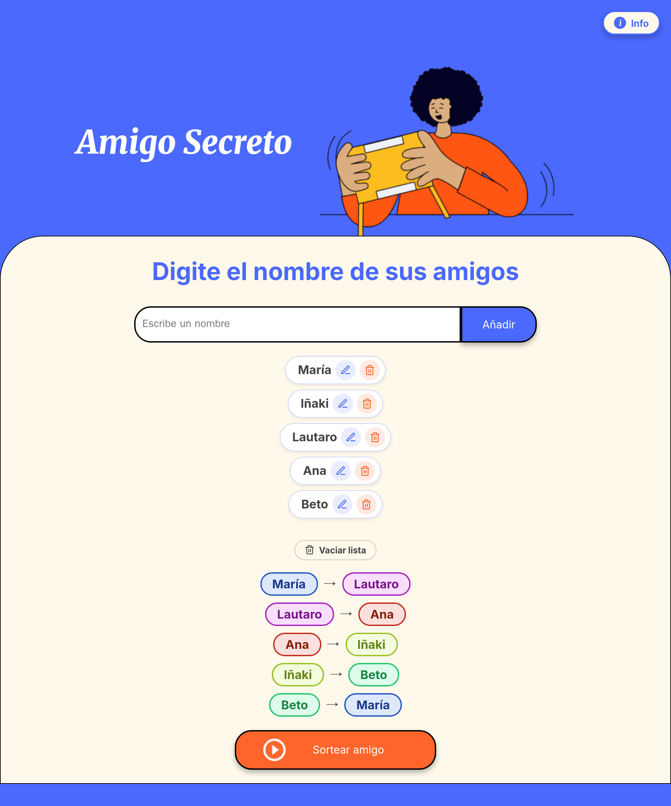

# Amigo Secreto

[](https://github.com/Neo236/amigo-secreto/actions/workflows/ci.yml)

Un sorteo de amigo secreto para el navegador. Cargás los nombres y arma toda la ronda de
una: a cada persona le asigna a quién le regala, sin que a nadie le toque su propio nombre.

Lo hice para el challenge de **Alura Latam** (programa Oracle Next Education). La interfaz
es la del challenge; lo que le puse encima es la lógica del sorteo con tests, la gestión de
la lista y algunos detalles de accesibilidad.

**[Probalo acá →](https://neo236.github.io/amigo-secreto/)**



## Qué se puede hacer

- Agregar, editar o quitar nombres, o vaciar la lista entera (pregunta antes de borrar).
- La validación es en la página, no con los `alert` del navegador: avisa si el nombre está
  vacío, repetido o es demasiado largo.
- El sorteo arma la ronda completa (hace falta un mínimo de 3). En el resultado cada nombre
  lleva su color: como todo es un solo círculo, seguís quién le regala a quién de un vistazo.
- Todo anda con teclado: Enter agrega, y editando un nombre Enter guarda y Escape cancela.

No hay dependencias en runtime ni paso de build: es HTML, CSS y JavaScript, y lo que está en
el repo es lo que corre.

## El sorteo

La parte con algo de sustancia es cómo se arman los pares. Si sortearas cada regalo por
separado, podrían quedar dos personas regalándose entre ellas y el resto aparte. Para
evitarlo, mezclo la lista (Fisher-Yates) y hago que cada uno le regale al siguiente, y el
último al primero: un solo círculo.

```
Mezclada:  Ana · Beto · Caro
Ronda:     Ana → Beto → Caro → Ana
```

Así nadie se toca a sí mismo y no quedan subgrupos cerrados.

## Correrlo

Usa módulos ES, así que hay que servirlo por HTTP (abrir el `index.html` a mano no alcanza):

```bash
npx serve .
```

## Tests

```bash
npm install
npm test
```

La lógica vive en `sorteo.js`, separada del DOM, con 22 tests en [Vitest](https://vitest.dev).
El que más me interesa recorre el resultado como un grafo y comprueba que sea un único ciclo:
sin eso, un sorteo podría partirse en subgrupos sin que nadie lo note.

## Cómo está armado

```
index.html      la pantalla
style.css       los estilos (los originales de Alura)
sorteo.js       la lógica, sin DOM
app.js          conecta la lógica con la pantalla
sorteo.test.js  los tests
```

## Accesibilidad

El resultado va en una región `aria-live`, así un lector de pantalla lo anuncia al aparecer.
Los botones de ícono llevan `aria-label` y el foco de teclado es visible. Los nombres se
insertan con `textContent`, nunca con `innerHTML`.

---

Hecho por Lautaro Mambrin.
